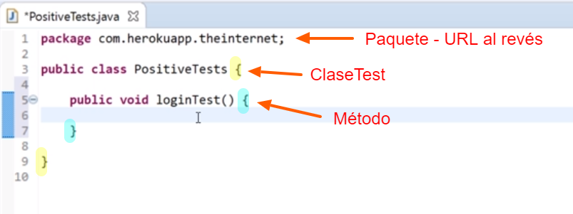
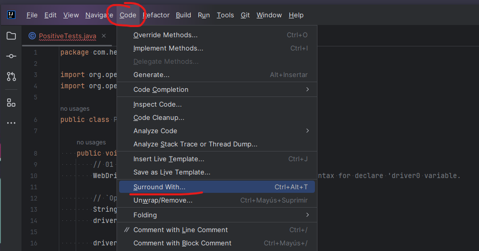
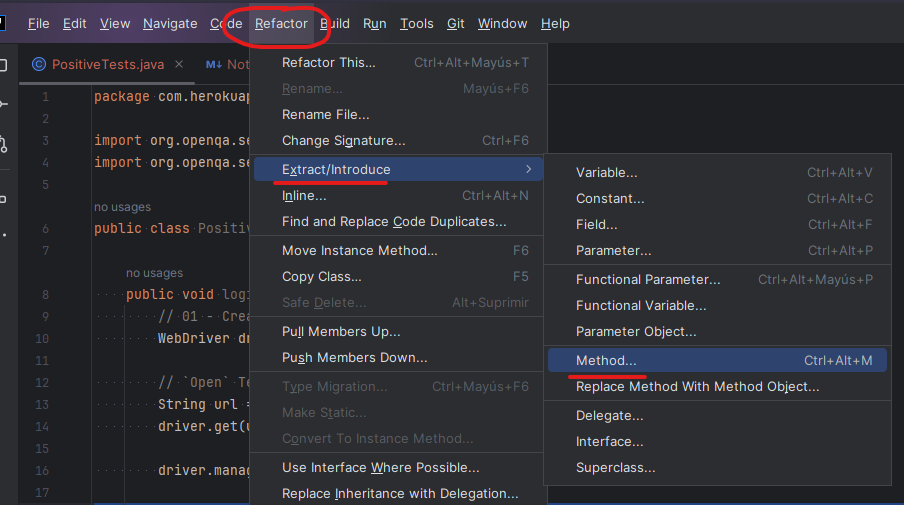
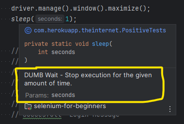

# SeleniumWD-4-beginners

In ECLIPSE,  CTRL + SHIFT + O  - automatically imports missing packages.

## Notas
### ATAJOS en Intelli J

- CTRL + D - copia la línea actual
- **main** - crea el Método completo
- CTRL + SHIFT + UP/DOWN  - Mover línea de código seleccionada

> public static void main(String[] args) {
> 
> }

- **sout** - crea la salida de texto
- **fori** - crea ciclos For
- Shift + F10 - Run program

---

## Section 1

### System Under Test (SUT)

http://the-internet.herokuapp.com/

## Section 2

Config of IntelliJ using Maven POM file
- TestNG
- Selenium
- https://github.com/dimashyshkin
- https://github.com/dimashyshkin/Selenium-WebDriver-with-Java-for-beginners

## Section 3

### 3.10 Test Case #1

- Enter http://the-internet.herokuapp.com/
- Click on `Form Authentication`
- Enter `tomsmith` for the username.
- Enter `SuperSecretPassword!` for the password
- Click `Login`
- Validate messages:
  - `You logged into a secure area!`
  - `Secure Area`
  - `Welcome to the Secure Area.`
- Click on `Logout`
  - Validate message `You logged out of the secure area!`

### 3.11 First Selenium Test Class - Naming Conventions

`PositiveTests.java`
---

`Package`

Naming convention on Packages. Reverse SUT HTML address in `lowercase`

`com.herokuapp.theinternet`

`Classes`

On creating `Test classes` on Maven Project, under `src/test/java`
the name should include the word `Test` or `Tests` for Maven to understand this is
a TEST class.

CamelCase, each first letter must be UPPERCASE.
`PositiveTests.java`
---

`methods`

Inside classes, methods can be named starting LOWER case.
Next words can start UPPER case.
`loginTest`

### WebDriver since Selenium 4.6

Selenium automatically detects Browser version, and updates the WebDriver.

> TRUCAZO

        Thread.sleep(1000);  //Stupid wait

1. Seleccionar la línea

2. Menú  CODE > Surround with > `Try - Catch`

        try {
            Thread.sleep(1000);
        } catch (InterruptedException e) {
            throw new RuntimeException(e);
        }

3. Seleccionar este código y

4. Sencillamente, se nombra `sleep`

    private static void sleep() {
        try {
            Thread.sleep(1000);
        } catch (InterruptedException e) {
            throw new RuntimeException(e);
        }
    }

5. Le agregamos parámetros, con Data Type y lo integramos.

     private static void sleep(int seconds) {
         try {
         Thread.sleep(seconds * 1000L);
         } catch (InterruptedException e) {
         throw new RuntimeException(e);
         }
     }

6. Finalmente, en el llamado al método, le ponemos un valor, porque ya marca error.

7. LISTO, con UNA línea ya lo podemos usar tantas veces queramos en los pasos de esta clase.

       sleep(1);

8. Justo arriba del método, al final de la clase, teclear

> /**

y opimir ENTER. Aparece automáticamente este formato de comanterio.

9. Comentar una descripción del método.

    /**
     * DUMB Wait - Stop execution for the given amount of time.
     * @param seconds
     */
    private static void sleep(int seconds) {
        try {
            Thread.sleep(seconds * 1000L);
        } catch (InterruptedException e) {
            throw new RuntimeException(e);
        }
    }

10. Ahora, cuando ponemos el cursor sobre el llamado al método en el código, nos muestra lo siguiente.

### That's a WRAP

Video 3.12  - 13:00 - 28/11/2023

---

---

